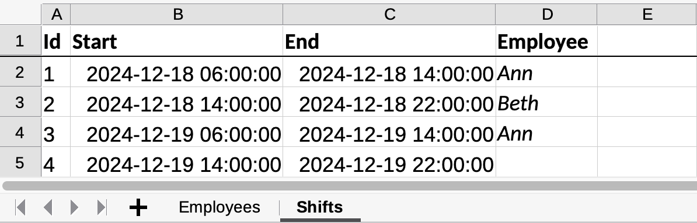
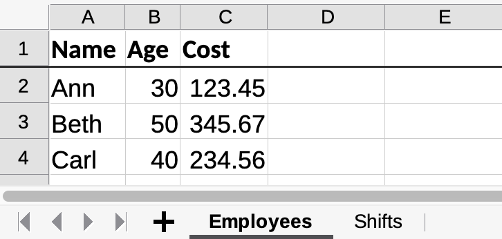

= Classysheet

image:https://img.shields.io/badge/stackoverflow-ask_question-orange.svg?logo=stackoverflow&style=for-the-badge["Stackoverflow", link="https://stackoverflow.com/questions/tagged/classysheet"]
image:https://img.shields.io/github/discussions/classysheet/classysheet?style=for-the-badge&logo=github["GitHub Discussions", link="https://github.com/classysheet/classysheet/discussions"]
image:https://img.shields.io/github/issues/classysheet/classysheet?style=for-the-badge&logo=github["GitHub Issues", link="https://github.com/classysheet/classysheet/issues"]

== What is Classysheet?

An *object to spreadsheet mapper* that converts Java (or Kotlin) objects
to (or from) a spreadsheet, such as Google Sheets or Excel.
It can be customized through class annotations.

== How does it work?

. Annotate your domain classes or records with an `@Sheet` annotation:
+
----
@Sheet
public class Shift {
    private String id;
    private LocalDateTime start;
    private LocalDateTime end;
    private Employee employee;
    ...
}
----
+
If another sheet uses it, add an `@IdColumn` annotation on a field:
+
----
@Sheet
public record Employee(
    @IdColumn String name,
    long age,
    double cost) {}
----

. Export it to Excel:
+

+

. Or Google Sheets: TODO

== How do I use it?

. Create a class to wrap all data that goes into the workbook:
+
----
@Workbook
public class Schedule {
    private List<Employee> employees;
    private List<Shift> shifts;
    ...
}
----

. Once, when bootstrapping your application, create the `ClassysheetService` singleton:
+
----
ClassysheetService<Schedule> classysheetService = ClassysheetService.create(Schedule.class);
----

. To import/export data from/to a spreadsheet, use a read/write method on the `ClassysheetService`:
+
----
Schedule schedule = ...;
classysheetService.writeExcelTmpFileAndShow(schedule);
----

*Note*: reading is not yet supported.

== Get started

Take a look at the examples:

- link:examples/hello-world-java/src/main/java/org/classysheet/examples/ExcelExample.java[Hello world Java (Excel)]
- link:examples/quarkus-java/src/main/java/org/classysheet/examples/quarkus/rest/ClassysheetResource.java[Quarkus Java (Excel)]

== Build from source

. Install JDK 17+ and Maven 3.9+, for example with https://sdkman.io[Sdkman]:
+
----
$ sdk install java
$ sdk install maven
----

. Git clone this repository:
+
----
$ git clone https://github.com/classysheet/classysheet.git
$ cd classysheet
----

. Build it from source:
+
----
$ mvn clean install
----

== Run an example

* Run the Hello world example:
+
----
$ cd examples/hello-world-java
// Run ExcelExample or GoogleSheetExample
----

* Run the Quarkus example:
+
----
$ cd examples/quarkus-java
$ mvn clean quarkus:dev
----
+
Open http://localhost:8080

== FAQ

=== Is it free to use for commercial use?

Yes, it's Apache Software License 2.0.

=== Why did you name it Classysheet?

_Classysheet_ stands for _Java class and spreadsheet_:

- `class` is short for `Java class`
- `y` is Spanish for `and`
- `sheet` is short for `spreadsheet`

=== Really?

No, not really. We just wanted to use the phrase "_It's really Classysheet!_" in a presentation.

We also considered naming it _Sheetify_, but the phrase "_Let's sheetify it!_" didn't quite work.

== Contribute

This is an open source project, and you are more than welcome to contribute!

== Sponsors

The original code was developed and open sourced by https://timefold.ai[Timefold] during a team hacketon.
Timefold is an open source solver for the vehicle routing problem, employee shift scheduling, maintenance scheduling
and other planning problems.